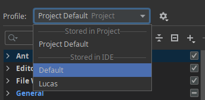
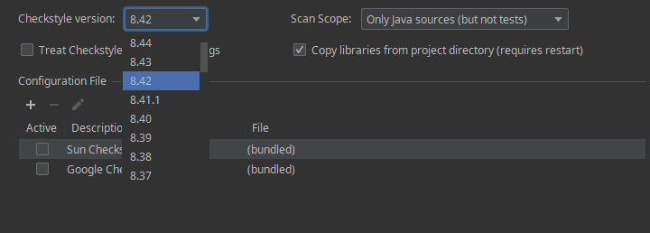
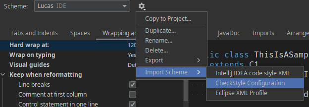

# IntelliJ neues Projekt erstellen

1. Oben Rechts in der Übersicht auf `New Project` klicken
2. Java 11 auswählen
3. Next
4. Next
5. Projektname angeben + Pfad und dann Finish drücken

# Klassen/Pakete erstellen


Am besten immer direkt ein `edu.kit.informatik` Paket
und eine Main-Klasse erstellen. Das sollte dann in etwa so aussehen:


(Beim Klassen erstellen kein `.java` dazu schreiben)

# Programme ausführen

Oben Rechts in IntelliJ ist ein Knopf, um eine Konfiguration
zu erstellen:


Dann drückt man entweder oben Links auf das `+` oder
einfach auf den `Add new run configuration` Text:


Hier hat man dann mehrere Auswahlmöglichkeiten für die Art
der Anwendung. Für Programmieren reicht eine `Application`:


Hier sucht man sich einen schönen Namen für die Konfiguration
aus, oder wenn man etwas unkreativ ist, dann nennt man die einfach
`Main` oder `Run`:


Wie man auf dem Screenshot sieht, ist dort ein Feld rot markiert,
IntellIJ weiß nicht welche Klasse es ausführen soll. In der Kommandozeile hatte man das ja immer explizit angegeben durch zum Beispiel `java Main`.

Hier muss man auf jeden Fall rechts im Feld auf dieses Quadrat-Symbol drücken und es werden einem mögliche Klassen vorgeschlagen:


**Wichtig**: Es werden nur Klassen vorgeschlagen, die eine `main` methode haben:

```java
package edu.kit.informatik;

public class Main {
    public static void main(String[] args) {
        System.out.println("Hello World!");
    }
}
```

Das sollte dann in etwa so aussehen:


In das blau markierte Feld namens `Program arguments` kann
man dann noch gegebenenfalls die `args` übergeben, wie man
es zum Beispiel bei der Aufgabe B von Blatt 1 mit dem `args[0]` hatte.

Zum Beispiel könnte man die so übergeben:


Zu Testzwecken kann man sich diese auch mal ausgeben lassen,
dazu nutzt man entweder eine for-Schleife:

```java
package edu.kit.informatik;

public class Main {
    public static void main(String[] args) {
        for (int i = 0; i < args.length; i++) {
            System.out.printf("arg[%d] : \"%s\" %n", i, args[i]);
        }
    }
}
```

oder

```java
package edu.kit.informatik;

import java.util.Arrays;

public class Main {
    public static void main(String[] args) {
        System.out.println(Arrays.toString(args));
    }
}
```

Wenn man die args wieder ändern möchte, muss man wieder oben rechts
die Konfiguration bearbeiten.

# Konfiguration von IntelliJ

Die Einstellungen findet man oben links im `File` tab:


Es ist sehr zu empfehlen sich da selbst mal durchzuklicken und alle Optionen so einzustellen
wie sie einem am besten gefallen. Ein paar wichtige Menü-Punkte sind:

## Appearance & Behavior > Appearance
Hier kann man das Theme auswählen (muss man zuvor installieren) und die Schriftart der
Benutzeroberfläche von IntelliJ ändern.

Dort kann man auch unter UI Options den Hacken bei `Show tree ident guides` anschalten.

## Keymap

Falls man möchte kann man hier die Tasten-Kombinationen von so gut wie allem
ändern.

Ich habe dort folgendes geändert:
- Main Menu > Edit > Undo auf Ctrl + Z
- Main Menu > Edit > Redo auf Ctrl + Y
- Main Menu > Edit > Join Lines Shortcut entfernt
- Main Menu > Code > Move Statement Down entfernt
- Main Menu > Code > Move Statement Up entfernt
- Main Menu > Code > Move Line Down auf Ctrl + Down (Pfeiltaste nach unten)
- Main Menu > Code > Move Line Up auf Ctrl + Up (Pfeiltaste nach oben)

## Editor

Hier sind die wirklich nützlichen Einstellungen drinnen

### General


### General > Appearance


**(ich will keine Tabs mehr in Abgaben sehen!)**

### Font

Hier kann man die vordefinierte Schriftart für den Editor ändern.
Es kann im Prinzip jede Schriftart gewählt werden, aber man sollte
darauf achten, dass es sich hierbei um eine Monospace Schriftart handelt
(jeder Buchstabe hat die gleiche breite).

Ich persönlich nutze "Fira Code" mit "ligatures". Das sorgt dafür, dass
zum Beispiel ein `>=` zu einem einzigen Symbol wird:


Die Schriftart kann man sich hier herunterladen: 
https://github.com/tonsky/FiraCode

Alternativ ist die Schriftart "Source Code Pro" zu empfehlen:
https://fonts.google.com/specimen/Source+Code+Pro

Natürlich kann man auch die standard Schriftart verwenden oder eine ganz andere.

### Inspections

Hier ist es sehr zu empfehlen sich mal durchzuklicken und anzuschauen was die
einzelnen Inspections machen (besonders unter dem Java Tab).



**Wichtig**: Oben im Profile Tab die "Stored in IDE" auswählen, damit die Inspections
auch für alle zukünftigen Projekte aktiv sind.

Profile kann man hier importieren:


## Plugins

Generell kann man das installieren was man möchte, aber hier sind ein paar Empfehlungen:

- Indent Rainbow : macht die Einrückungen farbig, das hilft immens bei der Übersicht
- Rainbow Brackets : Wie Indent Rainbow, aber für Klammern
- Sonar Lint
- CheckStyle-IDEA

(oben befindet sich so ein Marketplace tab, da kann man Plugins installieren)

Für Sonar Lint sollte man, nachdem man es installiert hat,
in den Einstellungen unter `Tools > Sonar Lint > Rules > Java`
den Lint `Standard outputs should not be used directly` ausschalten:


(oben ist eine Suche)

Checkstyle muss man auch konfigurieren, hierbei ist zu beachten,
dass der Checkstyle für jede Aufgabe neu gesetzt werden muss und die Datei nicht bewegt/gelöscht werden darf.

Hierzu unter `Tools > Checkstyle` in den Einstellungen oben die passende Version auswählen (deswegen gibt es mehrere Checkstyle Dateien).



und dann kann man auf das `+` drücken, um einen Checkstyle
zu importieren.


Am besten kopiert man sich die Checkstyle Datei in den Projekt Ordner und setzt den Haken bei `Store relative to project location`.

Checkstyle sollte jetzt hier in der Liste sein und dann einfach
den Haken setzen:


### Editor > Code Style > Java

Hier ist es noch zu empfehlen den Checkstyle zu importieren (der überschreibt das aktuell ausgewählte Scheme).
Auch hier wieder wichtig: IDE Scheme auswählen und nicht nur vom Projekt!



Hier dann einfach die Checkstyle Datei `optionalCheckstyleRules_842.xml` auswählen und schon hat man das erledigt.

**Ganz wichtig**:
IntelliJ fasst standardmäßig mehrere import aus dem gleichen package zusammen und schreibt dafür einen `*` (sogenannte wildcard imports).
Diese geben Abzug und muss man deswegen unbedingt ausschalten.
Dazu in den Einstellungen unter `Editor > Code Style > Java` auf Imports gehen und dort die Zahlen auf 999 setzen:


# Quellcode formatieren

Falls der Quellcode nicht mit dem Checkstyle übereinstimmt, kann IntelliJ den Quellcode einem formatieren.

Ich denke die Webseite hierzu ist relativ selbsterklärend:
https://www.jetbrains.com/help/idea/reformat-and-rearrange-code.html


Es wäre gar nicht schlecht, wenn man das unter `Automatically reformat code on save` macht, damit der Quelltext automatisch beim speichern (Ctrl + S) formatiert wird.

# Git nutzen/Artemis abgeben

Falls man dann in Artemis abgeben kann, lädt man sich das Projekt mit `git clone` in der Commandozeile herunter oder benutzt dafür die Option `Get from VCS` (zuvor das Projekt schließen, oben unter `File > Close Project`).

Dann hat man zwei Projekt-Ordner, einen von Artemis und einen in dem bereits der ganze Quellcode ist.

Im Explorer kopiert man sich dann vom Artemis Ordner die Dateien `.git`, `.classpath`, `.gitignore`, `.project` und `.gitattributes` rüber in das Projekt mit dem ganzen Quellcode.

(bitte schaut aber nochmal in src/ rein, dass euer Code mit der Vorlage von Artemis übereinstimmt)

Das sollte dann in etwa so aussehen:


Das Projekt dann wieder öffnen. Es sollte links ein neuer Tab vorhanden sein namens `Commit`:


Da drückt man drauf und es sieht in etwa so aus (je nachdem welche Dateien man drinnen hat):


Dann setzt man bei allen Dateien den Haken, gibt unten eine Nachricht ein und drückt auf `Commit and Push...`:


Gegebenenfalls kommt eine Warnung mit Checks die fehlgeschlagen sind, dann muss man nochmal auf `Commit Anyway and Push...`
drücken:


Ein neues Fenster öffnet sich:


und man drückt einfach unten auf den blauen Push Knopf.

Falls der Push fehlgeschlagen ist, weil man zum Beispiel vergessen hat den VPN anzuschalten:


Muss man erneut pushen, dazu gibt es oben Rechts den grünen Pfeil der nach oben zeigt:


und dann sollte das Fenster wieder da sein, indem man einfach nur auf Push drücken muss.